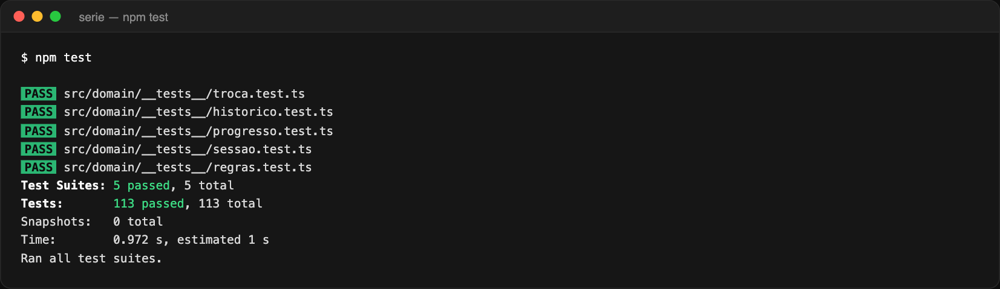

<div align="center">


**Caderno de treino que sabe o que você fez da última vez e já chega com o campo preenchido.**

   

[O problema](#o-problema) · [O app rodando](#o-app-rodando) · [Telas e fluxos](#telas-e-fluxos) · [As 21 telas](#as-21-telas) · [Integrantes](#integrantes-e-papéis) · [Como rodar](#como-rodar) · [Testes](#ambiente-de-teste) · [Stack](#stack) · [Entregas](#estado-das-entregas)

</div>

---

> **Checkpoints 4, 5 e 6 — Mobile Development & IoT**
> Engenharia de Software · 3º ano · FIAP · Prof. Hercules Ramos

## O problema

Quem treina sem personal anota no bloco de notas ou num papel amassado dentro do armário. Os apps
que existem hoje são de dois tipos, e nenhum resolve:

| Categoria | Exemplos | Por que falha |
|---|---|---|
| Catálogo de exercícios | biblioteca com GIF, "escolha seu treino" | te dá conteúdo e some na hora que importa: entre as séries |
| Planilha com skin | log de séries, tabelão | te faz digitar tudo do zero toda vez. Morre na 2ª semana |

O terceiro caminho é o único que interessa: **o app já chega com o campo preenchido**. Você confirma
com um toque ou corrige o número. É a diferença entre *registrar* e *ser guiado*.

📄 Escopo completo em [`docs/escopo.md`](docs/escopo.md) · 💰 Modelo de negócio em [`docs/pitch.md`](docs/pitch.md)

## O app rodando

**CP5 — protótipo funcional com dados mockados.** Capturas do app de verdade rodando em
`npm run web` (Expo + React Native Web) num viewport de celular, percorrido tela a tela: um treino A
inteiro (16 séries), com troca de aparelho no meio, até o resumo e de volta ao Hoje.


### O caminho crítico — telas 10 a 14

| | Tela | O que ela prova |
|---|---|---|
|  | **10 · Hoje** | Nada aqui é número cravado. *"Supino reto sobe para 42,5 kg"* sai da regra `CAR-1` cruzando o plano com o **histórico salvo no aparelho**: na última vez, 12 reps nas quatro séries a 40 kg |
|  | **11 · Treino ativo** | A carga alvo é o número dominante. O aviso — *"subiu de 40 kg, você fechou a faixa"* — é a dupla progressão explicando a si mesma |
|  | **12 · Execução** | `CAR-11`: a série é cronometrada e a tela inteira é o alvo de toque. **Durante a série ninguém toca no celular** — por isso não há campo nenhum aqui |
|  | **13 · Descanso** | É aqui que o registro acontece: 90 s de mãos livres. Os campos chegam preenchidos com o alvo (`CAR-2`) — confirmar é um toque, corrigir também é possível |
|  | **14 · Resumo** | `CAR-7`: compara com a **mesma letra** da vez anterior, sem mentir: no dia em que a carga sobe, as reps voltam ao piso e o volume cai — a tela destaca a carga que subiu e mostra o volume menor junto. Ouro só quando há recorde (`CAR-5`) |

### O app aprende

| | | |
|---|---|---|
|  | **10 · Hoje, depois do treino** | Terminado o A, a sessão vai para o histórico (AsyncStorage) e o Hoje já propõe o **B**, com a semana em *"2 de 4"*. Fechar e abrir o app não perde nada; recarregar no meio do treino volta para a mesma série (`CAR-8`) |

### As telas de apoio

| | Tela | O que ela prova |
|---|---|---|
|  | **16 · Trocar exercício** | `CAR-9`, o diferencial: aparelho ocupado, o app oferece as variações do **mesmo padrão de movimento e do mesmo grupo** — e nunca um exercício que já está no treino do dia |
|  | **11 · depois da troca** | `CAR-9.1`: na variação nova a carga é **estimada e declarada como tal**. 16 kg por mão no halter viram 40 kg na barra, arredondados para a anilha |
|  | **15 · Exercício** | Histórico e prescrição juntos: o 1RM recorde como número dominante, a carga das últimas sessões e o que o plano prescreve hoje |
|  | **17 · Meus treinos** | As letras do plano, quando cada uma foi feita pela última vez e qual é a próxima |
|  | **20 · Progresso** | `CAR-4`: treinos por semana e o volume por grupo muscular contra a faixa de 10 a 20 séries — responde *"o que estou negligenciando?"* |
|  | **21 · Perfil** | Ajustes, **exportar o histórico em CSV** (abre no Excel em português), apagar os dados e sair |

> Evidências de execução e como reproduzi-las: [`docs/evidencias/`](docs/evidencias/).

## Telas e fluxos

O mapa completo — rota de cada tela, o fluxo de navegação em diagrama e de onde vem cada número —
está em **[`docs/telas-e-fluxos.md`](docs/telas-e-fluxos.md)**. O resumo:

```
01 Abertura ─┬─ Já tenho conta ──▶ 02 Entrar ─┬─ 04 Recuperar senha ── 05 Link enviado
             │                                └─ 03 Criar conta
             └─ Montar meu treino ──────────────┐   (Entrar e Criar conta também levam ao Hoje)
      ┌─────────────────────────────────────────┴──── barra de abas: Hoje · Progresso · Treinos · Perfil
      ▼
   10 Hoje ── Começar treino ──▶ 11 Treino ativo ──▶ 12 Execução ──▶ 13 Descanso ──┐
                                   │   ▲                                            │
                                   │   └──────────── registra e volta ─────────────┘
                                   ├── Trocar exercício ──▶ 16 ──▶ volta à 11
                                   ├── Histórico ──▶ 15 Exercício
                                   └── última série ──▶ 14 Resumo ──▶ 10 Hoje (próxima letra)
```

## As 21 telas

A identidade visual do CP4 vive num arquivo do Figma com **21 telas conceituais, 83 Variables e 8
componentes** — protótipo navegável com 64 ligações e 2 pontos de partida. As imagens abaixo foram
exportadas do arquivo **como ele está agora**, tela por tela, e ficam em
[`docs/telas/`](docs/telas/).

**🔗 Figma:** https://www.figma.com/design/j9TqnMGzyjEpdjw18cLPBp

### Entrada e conta — telas 01 a 09

[](docs/telas/grupo-1-entrada.png)

A montagem do plano são **três perguntas**, uma por tela, não um formulário: peso (idade e altura
opcionais), quantos dias por semana você treina e o seu objetivo.
Delas sai a divisão A/B/C já preenchida — o app nunca mostra uma tela vazia pedindo que você
invente um treino.

### O treino — telas 10 a 14

[](docs/telas/grupo-2-treino.png)

O **caminho crítico** — as cinco estão em código, e são as capturas da seção anterior. Comparar as
duas fileiras é o teste de fidelidade que o CP6 cobra ("fidelidade ao conceito e identidade visual
definidos no CP4").

### Apoio — telas 15 a 21

[](docs/telas/grupo-3-apoio.png)

A **15 · Exercício** funde histórico e prescrição de propósito: são duas faces do mesmo substantivo,
e a progressão é o que justifica a prescrição. A **16 · Trocar exercício** é a `CAR-9` — aparelho
ocupado é o problema nº 1 da academia, e o histórico segue o *padrão de movimento*, não o aparelho.

**Em código no CP5:** 15, 16, 17, 20 e 21. A 18 (Montar treino), a 19 (Escolher exercício) e a
montagem do plano (06–09) ficam para o CP6 — no protótipo, o plano A/B/C vem dos dados mockados.

<details>
<summary>As 21 telas, uma a uma (arquivos individuais)</summary>

| | | |
|---|---|---|
| [01 · Abertura](docs/telas/01-abertura.png) | [02 · Entrar](docs/telas/02-entrar.png) | [03 · Criar conta](docs/telas/03-criar-conta.png) |
| [04 · Recuperar senha](docs/telas/04-recuperar-senha.png) | [05 · Link enviado](docs/telas/05-link-enviado.png) | [06 · Montagem 1/3](docs/telas/06-montagem-1-de-3.png) |
| [07 · Montagem 2/3](docs/telas/07-montagem-2-de-3.png) | [08 · Montagem 3/3](docs/telas/08-montagem-3-de-3.png) | [09 · Seu plano](docs/telas/09-seu-plano.png) |
| [10 · Hoje](docs/telas/10-hoje.png) | [11 · Treino ativo](docs/telas/11-treino-ativo.png) | [12 · Execução](docs/telas/12-execucao.png) |
| [13 · Descanso](docs/telas/13-descanso.png) | [14 · Resumo da sessão](docs/telas/14-resumo-da-sessao.png) | [15 · Exercício](docs/telas/15-exercicio.png) |
| [16 · Trocar exercício](docs/telas/16-trocar-exercicio.png) | [17 · Meus treinos](docs/telas/17-meus-treinos.png) | [18 · Montar treino](docs/telas/18-montar-treino.png) |
| [19 · Escolher exercício](docs/telas/19-escolher-exercicio.png) | [20 · Progresso](docs/telas/20-progresso.png) | [21 · Perfil](docs/telas/21-perfil.png) |

</details>

## Integrantes e papéis

> O enunciado marca este item como **obrigatório**: *"deve estar presente na documentação o papel
> desempenhado por cada membro do grupo"*. Grupo de 4 a 6 alunos, o mesmo nos três checkpoints.

| Nome | RM | Papel | Responsável por |
|---|---|---|---|
| João Victor Franco | 556790 | **Product Owner · Design System** | regras `CAR-*`, tokens, arquivo do Figma, protótipo |
| Lucca Borges | 554608 | **Dev Front** | telas em React Native, navegação |
| Ruan Melo | 557599 | **Dev Mock / Dados** | camada de dados, persistência local, mocks do CP5 |
| Rodrigo Jimenez | 558148 | **Design** | identidade visual, ícone, splash, assets |
| Bruno Leão | 555563 | **QA · Documentação · Dev** | roteiro de testes, README, evidências de entrega, apoio em desenvolvimento |

## Como rodar

Pré-requisitos: **Node 20.19.4+ ou 22.13+** (a faixa que o React Native 0.86 exige) e o app **Expo Go** no celular (ou o emulador do Android Studio).

```bash
git clone https://github.com/jota0802/serie.git
cd serie
npm install
npm start
```

Depois de `npm start`, leia o QR Code com o Expo Go, ou pressione:

| Tecla | O que faz |
|---|---|
| `a` | abre no emulador do Android Studio |
| `i` | abre no simulador do iOS (só macOS) |
| `w` | abre no navegador |

## Ambiente de teste

As regras do app são funções puras, sem React e sem tela — dá para testá-las sem montar componente
nenhum. São **113 testes em 5 suítes**, em [`src/domain/__tests__/`](src/domain/__tests__/):

```bash
npm test
```

```
PASS src/domain/__tests__/troca.test.ts
PASS src/domain/__tests__/historico.test.ts
PASS src/domain/__tests__/progresso.test.ts
PASS src/domain/__tests__/sessao.test.ts
PASS src/domain/__tests__/regras.test.ts
Test Suites: 5 passed, 5 total
Tests:       113 passed, 113 total
Snapshots:   0 total
Time:        0.972 s, estimated 1 s
Ran all test suites.
```



| Suíte | O que prova |
|---|---|
| [`regras.test.ts`](src/domain/__tests__/regras.test.ts) | dupla progressão, deload, 1RM estimado, volume semanal |
| [`historico.test.ts`](src/domain/__tests__/historico.test.ts) | os **dados mockados são coerentes** entre si, e recorde, tonelagem anterior e a próxima letra saem das séries |
| [`sessao.test.ts`](src/domain/__tests__/sessao.test.ts) | o caminho crítico de ponta a ponta (começar → registrar as 16 séries → o Hoje propõe a próxima letra), a sessão retomável por 6 h e o texto do resumo |
| [`troca.test.ts`](src/domain/__tests__/troca.test.ts) | a `CAR-9`: alternativas por padrão e grupo, e a carga estimada por equipamento |
| [`progresso.test.ts`](src/domain/__tests__/progresso.test.ts) | a tela de Progresso (`CAR-4`, frequência semanal, recordes) e o CSV exportado |

O caso que mais importa continua sendo **"série faltando não conta como faixa fechada"**: sem ele a
carga sobe por causa de um treino incompleto, e o usuário chega na academia com um número que não
conquistou.

## Estrutura de pastas

```
serie/
├── src/
│   ├── app/            # rotas — Expo Router (file-based routing)
│   │   ├── index.tsx       # 01 · Abertura
│   │   ├── entrar.tsx      # 02 · Entrar
│   │   ├── criar-conta.tsx     # 03 · Criar conta
│   │   ├── recuperar-senha.tsx # 04 · Recuperar senha
│   │   ├── link-enviado.tsx    # 05 · Link enviado
│   │   ├── hoje.tsx        # 10 · Hoje — a porta do caminho crítico
│   │   ├── treino/         # 11 ativo · 12 execução · 13 descanso · 14 resumo · 16 trocar
│   │   ├── exercicio/[id].tsx  # 15 · Exercício
│   │   ├── treinos.tsx     # 17 · Meus treinos
│   │   ├── progresso.tsx   # 20 · Progresso
│   │   └── perfil.tsx      # 21 · Perfil
│   ├── components/     # os componentes do design system
│   ├── domain/         # as regras CAR-* como funções puras. O "cérebro" do app
│   │   └── __tests__/  # 5 suítes Jest — 113 testes
│   ├── data/           # os mocks: 45 exercícios, treinos A/B/C, histórico de fábrica
│   ├── estado/         # Context API: histórico persistido (AsyncStorage) e a sessão em andamento
│   ├── hooks/          # cronômetro, guarda da sessão, treino com a troca aplicada
│   ├── theme/          # tokens (cor, tipografia, espaço, raio) — espelha o Figma
│   └── lib/            # utilitários (formatação em pt-BR, exportar CSV)
├── docs/
│   ├── telas-e-fluxos.md    # CP5: rota de cada tela, o fluxo de navegação, a origem dos dados
│   ├── escopo.md            # problema, público-alvo, proposta de valor
│   ├── pitch.md             # modelo de negócio e diferencial competitivo
│   ├── marca.md             # nome, logo, paleta, tipografia
│   ├── regras.md            # as 11 regras CAR-* — a lógica do produto
│   ├── decisoes-tecnicas.md # stack e o porquê de cada escolha
│   └── evidencias/          # prints do app rodando
└── assets/             # marca, ícone, splash
```

**Por que `domain/` é uma pasta separada:** as regras (dupla progressão, 1RM estimado, volume
semanal) não sabem que existe tela. Isso as torna testáveis com Jest sem montar componente — são as
113 testes de `npm test`, e é o que paga o item *"ambiente de teste configurado"* do CP5.
Detalhes em [`docs/decisoes-tecnicas.md`](docs/decisoes-tecnicas.md).

## A marca


Três barras crescentes: as séries do exercício. A maior é ouro porque, no app inteiro, **ouro
significa uma coisa só — recorde**. A mesma geometria vira ícone do app, ícone adaptativo do
Android, splash e favicon — todos gerados do vetor em
[`assets/brand/serie-mark.svg`](assets/brand/serie-mark.svg).

<br clear="left">


| | Token | Hex | Papel |
|---|---|---|---|
| ⬛ | `n1000` | `#0E0E0E` | base da tela |
| ⬜ | `n100` | `#F8F8F8` | texto primário · série feita · o alvo de hoje |
| 🟨 | `signal` | `#FFE657` | **recorde / alvo superado.** Só isso — 15,4:1 |
| 🟦 | `rest` | `#3B80FF` | **tempo correndo.** Só o cronômetro — 5,3:1 |
| 🟥 | `danger` | `#B0261A` | **só ação destrutiva**: apagar os dados, sair da conta |

**Duas** cores de sinal no app inteiro, não cinco — ouro e azul —, e o vermelho só em ação
destrutiva: cor rara é cor que significa. Tipografia: **Space Grotesk**
nos números e títulos, **Manrope** no texto. Tudo em [`docs/marca.md`](docs/marca.md).

## Stack

| Camada | Escolha | Por quê |
|---|---|---|
| App | **React Native + Expo (SDK 57)** | exigência do enunciado; roda no celular de todo o grupo e gera APK via EAS Build |
| Navegação | **Expo Router** | rotas por arquivo, e o *deep link* sai de graça |
| Linguagem | **TypeScript** | o modelo de domínio (Série, Sessão, Treino) é o coração do app; tipo errado aqui vira bug de carga |
| Testes | **Jest** (preset `jest-expo`) | as regras são funções puras: dá para testá-las sem montar tela |
| Dados (CP5) | **JSON local + AsyncStorage** | o enunciado do CP5 pede dados mockados, sem backend |
| Dados (CP6) | **Supabase** *(a confirmar)* | só para backup e login. O app é **offline-first**: academia é subsolo |

## Documentação

| Documento | O que tem dentro |
|---|---|
| [`docs/telas-e-fluxos.md`](docs/telas-e-fluxos.md) | **CP5:** as telas em código, a rota de cada uma, o fluxo de navegação e a origem dos dados |
| [`docs/escopo.md`](docs/escopo.md) | problema, público-alvo, proposta de valor, o que está **fora** do MVP |
| [`docs/pitch.md`](docs/pitch.md) | modelo de negócio (freemium) e diferencial competitivo |
| [`docs/marca.md`](docs/marca.md) | nome, marca gráfica, paleta de 14 neutros + 2 acentos e o vermelho de ação destrutiva, tipografia |
| [`docs/regras.md`](docs/regras.md) | as 11 regras `CAR-*` — a lógica que separa a Série de uma planilha |
| [`docs/decisoes-tecnicas.md`](docs/decisoes-tecnicas.md) | bibliotecas, arquitetura (estado, persistência, navegação) e o porquê de cada escolha |
| [`docs/telas/`](docs/telas/) | as 21 telas exportadas do Figma, uma a uma |
| [`docs/evidencias/`](docs/evidencias/) | prints do app rodando, o `npm test` verde e como reproduzir |

**Figma — Design System:** https://www.figma.com/design/j9TqnMGzyjEpdjw18cLPBp
21 telas conceituais · 83 Variables · 8 componentes · protótipo navegável com 64 ligações e 2 pontos
de partida. A pasta [`docs/telas/`](docs/telas/) é o espelho desse arquivo em PNG, para quem não tem
acesso ao Figma.

## Estado das entregas

| | Foco | Status |
|---|---|---|
| **CP4** — Idealização | conceito, marca, documentação inicial, setup | ✅ repositório, README, escopo, pitch, marca e projeto Expo prontos |
| **CP5** — Protótipo | protótipo funcional com dados mockados | ✅ 15 telas navegáveis com barra de abas, dados mockados persistidos no aparelho (AsyncStorage), 113 testes Jest, telas e fluxos documentados, prints do app rodando no navegador |
| **CP6** — Entrega final | app final e APK instalável | ⬜ não iniciado |

## Licença

Projeto acadêmico. Ver [`LICENSE`](LICENSE).
