<div align="center">

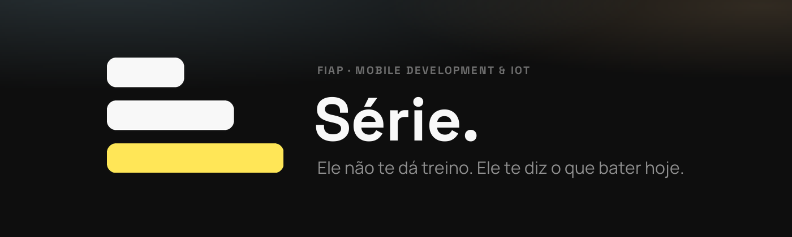

**Caderno de treino que sabe o que você fez da última vez e já chega com o campo preenchido.**

    

[O problema](#o-problema) · [O app final](#o-app-final--cp6) · [Instalar o APK](#instalar-o-apk) · [Manual de uso](docs/manual-de-uso.md) · [Telas e fluxos](#telas-e-fluxos) · [As 21 telas](#as-21-telas) · [Integrantes](#integrantes-e-papéis) · [Como rodar](#como-rodar) · [Testes](#ambiente-de-teste) · [Stack](#stack) · [Entregas](#estado-das-entregas)

</div>

---

> **Checkpoints 4, 5 e 6 — Mobile Development & IoT**
> Engenharia de Software · 3º ano · FIAP · Prof. Hercules Ramos

## O problema

Quem treina sem personal anota no bloco de notas ou num papel amassado dentro do armário. Os apps
que existem hoje são de dois tipos, e nenhum resolve:

| Categoria | Exemplos | Por que falha |
|---|---|---|
| Catálogo de exercícios | biblioteca com GIF, "escolha seu treino" | te dá conteúdo e some na hora que importa: entre as séries |
| Planilha com skin | log de séries, tabelão | te faz digitar tudo do zero toda vez. Morre na 2ª semana |

O terceiro caminho é o único que interessa: **o app já chega com o campo preenchido**. Você confirma
com um toque ou corrige o número. É a diferença entre *registrar* e *ser guiado*.

📄 Escopo completo em [`docs/escopo.md`](docs/escopo.md) · 💰 Modelo de negócio em [`docs/pitch.md`](docs/pitch.md)

## O app final — CP6

O protótipo do CP5 virou app de verdade, com conta, banco e APK:

| | O que o app faz | Telas |
|---|---|---|
| **Conta** | e-mail e senha no Supabase Auth. O plano e o histórico são da conta, não do aparelho: trocar de celular não perde nada | 01–05 e Nova senha |
| **Montagem do plano** | três perguntas (peso, dias por semana, objetivo) geram o plano A/B ou A/B/C, com a carga de partida de cada exercício calculada pelo peso | 06–09 |
| **Início** | a letra do dia, o que mudou desde a última vez e o **heatmap do ano**: um quadrado por dia, mais claro quanto mais séries, **ouro no dia de recorde** | 10 |
| **O treino** | o caminho crítico do CP5, agora com transições entre as telas, terminar antes salvando o que foi feito e um resumo que mostra **o que evoluiu** e o alvo da próxima vez | 11–16 |
| **Editar o plano** | dias de treino, ordem das letras, exercícios (adicionar, **trocar**, mover, tirar) e séries, faixa, carga e descanso de cada um | 17–19 |
| **Corrigir o histórico** | errou um número? corrige a série, tira a série ou apaga o treino; recorde, progresso e heatmap se recalculam na hora | Histórico |
| **Offline-first com nuvem** | tudo vale primeiro no aparelho e sobe para o Postgres quando houver rede. O Perfil diz se ainda há treino esperando conexão | — |

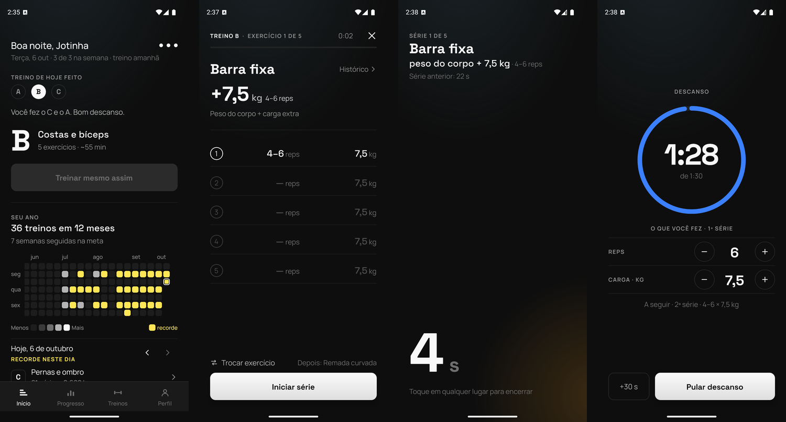
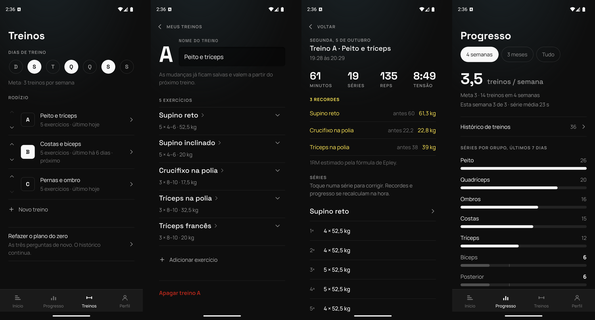

*O APK 1.0.1 rodando no emulador do Android Studio (Pixel 9, Android 16), logado numa conta de
verdade: os dados vêm do Supabase. Mais capturas e o que foi medido em
[`docs/evidencias/`](docs/evidencias/README.md#cp6--o-app-final-no-android).*

As regras de produto que nasceram com isso estão numeradas em
[`docs/regras-do-app.md`](docs/regras-do-app.md) (`RN-01` a `RN-54`), ao lado das regras de treino
(`CAR-*`, [`docs/regras.md`](docs/regras.md)). Para quem vai usar o app, o passo a passo está no
**[manual de uso](docs/manual-de-uso.md)**.

### Instalar o APK


**[⬇ Baixar a Série para Android](https://github.com/jota0802/serie/releases/latest/download/serie.apk)**
(versão 1.0.1, APK de 105 MB) — ou aponte a câmera do celular para o QR code.

| Onde | Validade |
|---|---|
| [Última Release no GitHub](https://github.com/jota0802/serie/releases/latest), com o `.apk` anexado | permanente: o link de cima baixa sempre a versão mais nova |
| [O 1.0.1 direto do EAS Build](https://expo.dev/artifacts/eas/LlHAsZjCifZtE1bj8mNRVrxTz8QCnBt990q31XgsVFw.apk) | até 20/10/2026 (a Expo apaga o arquivo depois) |

1. Baixe o `.apk` no celular Android e abra o arquivo. O Android pede para permitir "instalar
   apps desconhecidos" pelo navegador: permita.
2. Abra a **Série.**, toque em **Montar meu treino** e crie a conta.

Já tem a 1.0.0? O APK novo instala por cima, como atualização, e o login continua.

<br clear="right">

O APK é gerado pelo EAS Build (perfil `preview` do [`eas.json`](eas.json)); para gerar outro, veja
[Como rodar](#como-rodar).

## O protótipo do CP5

**CP5 — protótipo funcional com dados mockados.** Capturas do app de verdade rodando em
`npm run web` (Expo + React Native Web) num viewport de celular, percorrido tela a tela: um treino A
inteiro (16 séries), com troca de aparelho no meio, até o resumo e de volta ao Hoje.

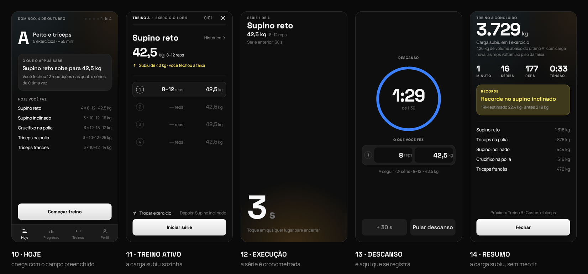

### O caminho crítico — telas 10 a 14

| | Tela | O que ela prova |
|---|---|---|
| 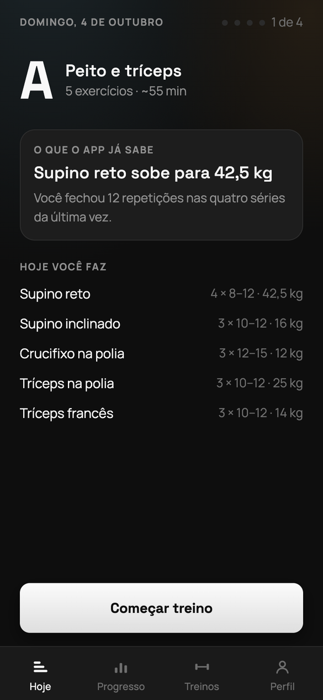 | **10 · Hoje** | Nada aqui é número cravado. *"Supino reto sobe para 42,5 kg"* sai da regra `CAR-1` cruzando o plano com o **histórico salvo no aparelho**: na última vez, 12 reps nas quatro séries a 40 kg |
| 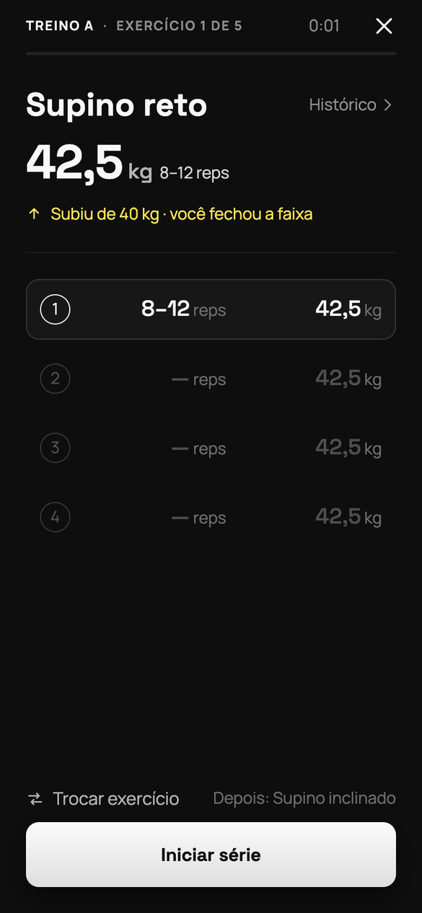 | **11 · Treino ativo** | A carga alvo é o número dominante. O aviso — *"subiu de 40 kg, você fechou a faixa"* — é a dupla progressão explicando a si mesma |
| 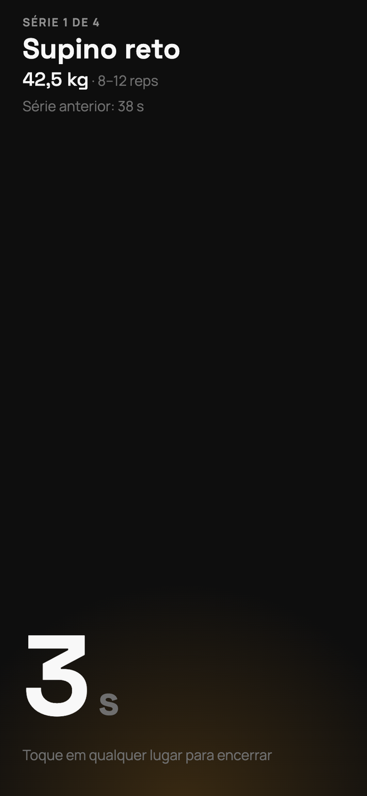 | **12 · Execução** | `CAR-11`: a série é cronometrada e a tela inteira é o alvo de toque. **Durante a série ninguém toca no celular** — por isso não há campo nenhum aqui |
| 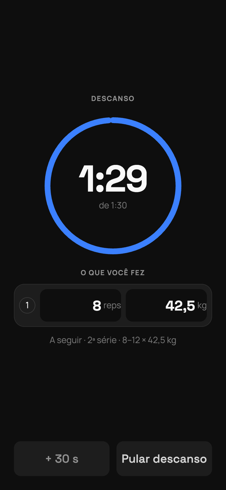 | **13 · Descanso** | É aqui que o registro acontece: 90 s de mãos livres. Os campos chegam preenchidos com o alvo (`CAR-2`) — confirmar é um toque, corrigir também é possível |
| 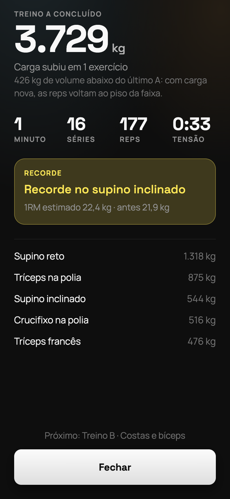 | **14 · Resumo** | `CAR-7`: compara com a **mesma letra** da vez anterior, sem mentir: no dia em que a carga sobe, as reps voltam ao piso e o volume cai — a tela destaca a carga que subiu e mostra o volume menor junto. Ouro só quando há recorde (`CAR-5`) |

### O app aprende

| | | |
|---|---|---|
| 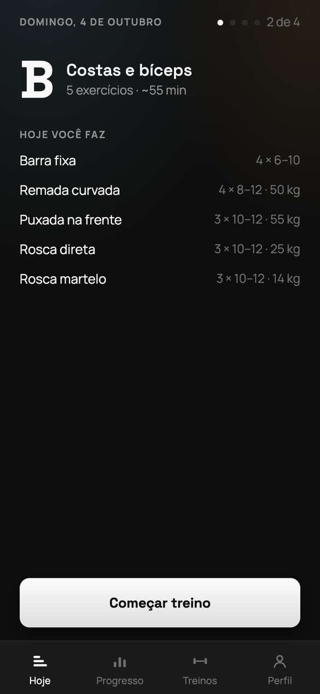 | **10 · Hoje, depois do treino** | Terminado o A, a sessão vai para o histórico (AsyncStorage) e o Hoje já propõe o **B**, com a semana em *"2 de 4"*. Fechar e abrir o app não perde nada; recarregar no meio do treino volta para a mesma série (`CAR-8`) |

### As telas de apoio

| | Tela | O que ela prova |
|---|---|---|
| 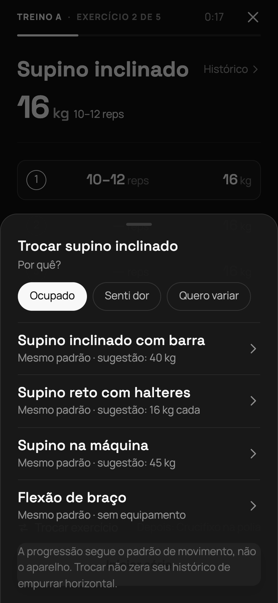 | **16 · Trocar exercício** | `CAR-9`, o diferencial: aparelho ocupado, o app oferece as variações do **mesmo padrão de movimento e do mesmo grupo** — e nunca um exercício que já está no treino do dia |
| 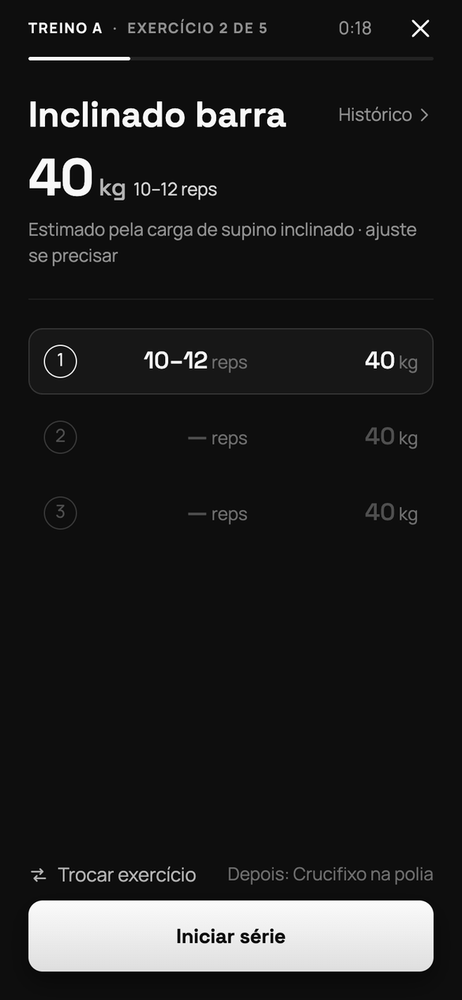 | **11 · depois da troca** | `CAR-9.1`: na variação nova a carga é **estimada e declarada como tal**. 16 kg por mão no halter viram 40 kg na barra, arredondados para a anilha |
| 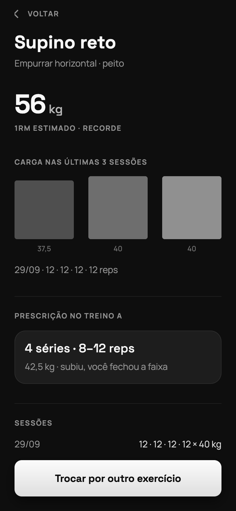 | **15 · Exercício** | Histórico e prescrição juntos: o 1RM recorde como número dominante, a carga das últimas sessões e o que o plano prescreve hoje |
| 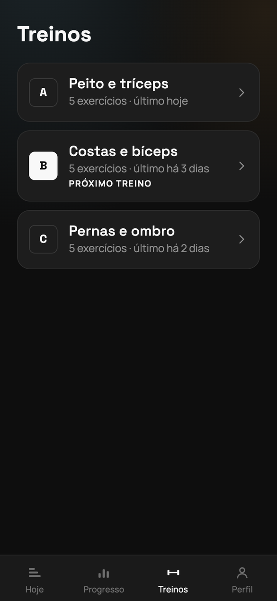 | **17 · Meus treinos** | As letras do plano, quando cada uma foi feita pela última vez e qual é a próxima |
| 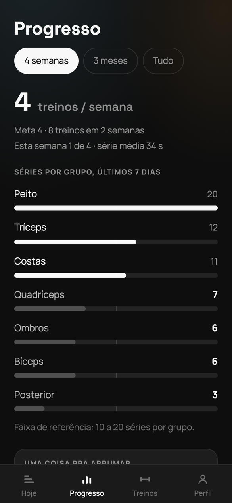 | **20 · Progresso** | `CAR-4`: treinos por semana e o volume por grupo muscular contra a faixa de 10 a 20 séries — responde *"o que estou negligenciando?"* |
| 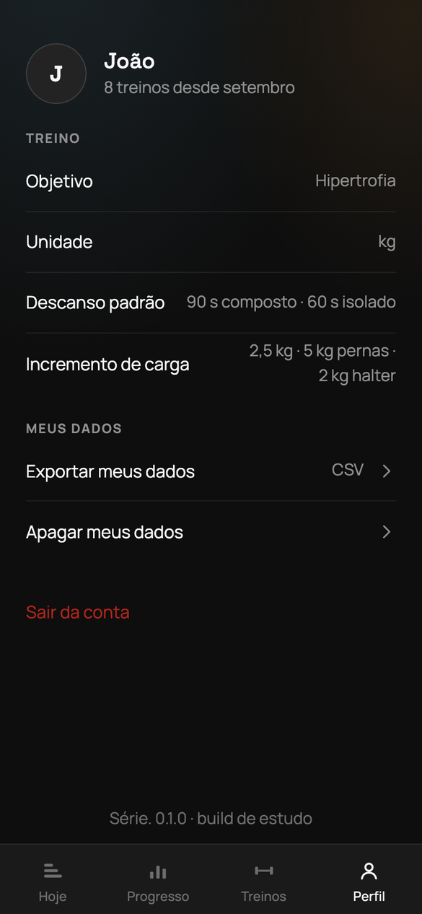 | **21 · Perfil** | Ajustes, **exportar o histórico em CSV** (abre no Excel em português), apagar os dados e sair |

> Evidências de execução e como reproduzi-las: [`docs/evidencias/`](docs/evidencias/).

## Telas e fluxos

O mapa completo — rota de cada tela, o fluxo de navegação em diagrama e de onde vem cada número —
está em **[`docs/telas-e-fluxos.md`](docs/telas-e-fluxos.md)**. O resumo:

```
01 Abertura ─┬─ Montar meu treino ──▶ 03 Criar conta ──▶ 06 Medidas ▶ 07 Dias ▶ 08 Objetivo ▶ 09 Seu plano ─┐
             └─ Já tenho conta ─────▶ 02 Entrar ─┬─ 04 Recuperar senha ── 05 Link enviado                     │
                                                 └─ conta com plano ──────────────────────────────────────────┤
      ┌───────────────────────────────────────────────────────────────────────────────────────────────────────┘
      ▼            barra de abas: Início · Progresso · Treinos · Perfil
   10 Início ── Começar treino ──▶ 11 Treino ativo ──▶ 12 Execução ──▶ 13 Descanso ──┐
      ▲                               │   ▲                                           │
      │                               │   └──────────── registra e volta ────────────┘
      │                               ├── Trocar exercício ──▶ 16 ──▶ volta à 11
      │                               ├── Histórico ──▶ 15 Exercício
      └─────── Fechar ── 14 Resumo ◀──┴── última série, ou X · Terminar e salvar

   17 Meus treinos ──▶ 18 Montar treino ──▶ 19 Escolher exercício (adicionar ou trocar)
   20 Progresso ──▶ Histórico ──▶ treino do histórico (corrigir uma série, apagar o treino)
```

## As 21 telas

A identidade visual do CP4 vive num arquivo do Figma com **21 telas conceituais, 83 Variables e 8
componentes** — protótipo navegável com 64 ligações e 2 pontos de partida. As imagens abaixo foram
exportadas do arquivo **como ele está agora**, tela por tela, e ficam em
[`docs/telas/`](docs/telas/).

**🔗 Figma:** https://www.figma.com/design/j9TqnMGzyjEpdjw18cLPBp

### Entrada e conta — telas 01 a 09

[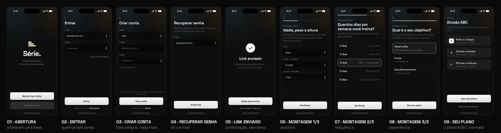](docs/telas/grupo-1-entrada.png)

A montagem do plano são **três perguntas**, uma por tela, não um formulário: peso (idade e altura
opcionais), quantos dias por semana você treina e o seu objetivo.
Delas sai a divisão A/B/C já preenchida — o app nunca mostra uma tela vazia pedindo que você
invente um treino.

### O treino — telas 10 a 14

[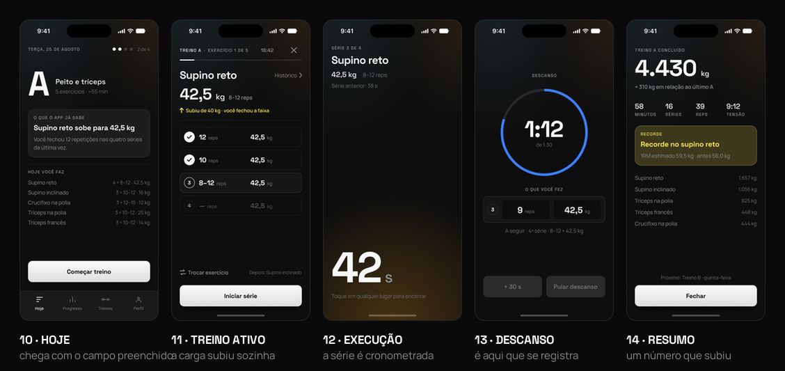](docs/telas/grupo-2-treino.png)

O **caminho crítico** — as cinco estão em código, e são as capturas do [protótipo do
CP5](#o-protótipo-do-cp5). Comparar as duas fileiras é o teste de fidelidade que o CP6 cobra
("fidelidade ao conceito e identidade visual definidos no CP4").

### Apoio — telas 15 a 21

[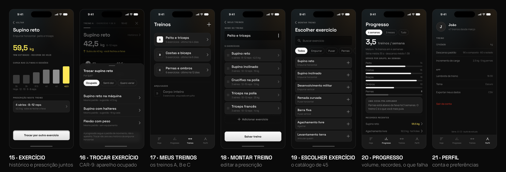](docs/telas/grupo-3-apoio.png)

A **15 · Exercício** funde histórico e prescrição de propósito: são duas faces do mesmo substantivo,
e a progressão é o que justifica a prescrição. A **16 · Trocar exercício** é a `CAR-9` — aparelho
ocupado é o problema nº 1 da academia, e o histórico segue o *padrão de movimento*, não o aparelho.

**No CP6, as 21 estão em código**, mais duas que o Figma não tinha: a **Nova senha** (aberta pelo
link do e-mail de recuperação) e o **Histórico**, onde se corrige o que foi registrado. No CP5
eram 15; a 18 (Montar treino), a 19 (Escolher exercício) e a montagem do plano (06–09) entraram
com o banco.

<details>
<summary>As 21 telas, uma a uma (arquivos individuais)</summary>

| | | |
|---|---|---|
| [01 · Abertura](docs/telas/01-abertura.png) | [02 · Entrar](docs/telas/02-entrar.png) | [03 · Criar conta](docs/telas/03-criar-conta.png) |
| [04 · Recuperar senha](docs/telas/04-recuperar-senha.png) | [05 · Link enviado](docs/telas/05-link-enviado.png) | [06 · Montagem 1/3](docs/telas/06-montagem-1-de-3.png) |
| [07 · Montagem 2/3](docs/telas/07-montagem-2-de-3.png) | [08 · Montagem 3/3](docs/telas/08-montagem-3-de-3.png) | [09 · Seu plano](docs/telas/09-seu-plano.png) |
| [10 · Hoje](docs/telas/10-hoje.png) | [11 · Treino ativo](docs/telas/11-treino-ativo.png) | [12 · Execução](docs/telas/12-execucao.png) |
| [13 · Descanso](docs/telas/13-descanso.png) | [14 · Resumo da sessão](docs/telas/14-resumo-da-sessao.png) | [15 · Exercício](docs/telas/15-exercicio.png) |
| [16 · Trocar exercício](docs/telas/16-trocar-exercicio.png) | [17 · Meus treinos](docs/telas/17-meus-treinos.png) | [18 · Montar treino](docs/telas/18-montar-treino.png) |
| [19 · Escolher exercício](docs/telas/19-escolher-exercicio.png) | [20 · Progresso](docs/telas/20-progresso.png) | [21 · Perfil](docs/telas/21-perfil.png) |

</details>

## Integrantes e papéis

> O enunciado marca este item como **obrigatório**: *"deve estar presente na documentação o papel
> desempenhado por cada membro do grupo"*. Grupo de 4 a 6 alunos, o mesmo nos três checkpoints.

| Nome | RM | Papel | Responsável por |
|---|---|---|---|
| João Victor Franco | 556790 | **Product Owner · Design System** | regras `CAR-*`, tokens, arquivo do Figma, protótipo |
| Lucca Borges | 554608 | **Dev Front** | telas em React Native, navegação |
| Ruan Melo | 557599 | **Dev Mock / Dados** | camada de dados, persistência local, mocks do CP5 |
| Rodrigo Jimenez | 558148 | **Design** | identidade visual, ícone, splash, assets |
| Bruno Leão | 555563 | **QA · Documentação · Dev** | roteiro de testes, README, evidências de entrega, apoio em desenvolvimento |

## Como rodar

Pré-requisitos: **Node 20.19.4+ ou 22.13+** (a faixa que o React Native 0.86 exige) e o app **Expo Go** no celular (ou o emulador do Android Studio).

```bash
git clone https://github.com/jota0802/serie.git
cd serie
npm install
npm start
```

Depois de `npm start`, leia o QR Code com o Expo Go, ou pressione:

| Tecla | O que faz |
|---|---|
| `a` | abre no emulador do Android Studio |
| `i` | abre no simulador do iOS (só macOS) |
| `w` | abre no navegador |

### O banco (Supabase)

O [`.env`](.env) do repositório já aponta para o Supabase do projeto, então `npm start` funciona
sem configurar nada. A chave dele é a **publicável**: ela vai dentro do APK de qualquer jeito, e
quem protege os dados é o RLS (cada conta só lê e grava as próprias linhas).

Para subir o app num projeto Supabase seu:

```bash
npx supabase login
npx supabase link --project-ref <ref do seu projeto>
npx supabase db push
npx supabase config push
```

O `db push` cria as tabelas e as políticas de [`supabase/migrations/`](supabase/migrations/); o
`config push` aplica o Auth de [`supabase/config.toml`](supabase/config.toml) (senha mínima de 8,
confirmação de e-mail desligada, links de "esqueci a senha"). Depois, troque a URL e a chave
publicável no `.env`.

### O APK (EAS Build)

```bash
npx eas-cli login
npx eas-cli build -p android --profile preview
```

O perfil `preview` gera um **APK** para instalar direto no celular; o `production` gera o `.aab`
da Play Store. O `eas-cli` roda pelo `npx` e **não** fica nas dependências do projeto (ver
[`docs/decisoes-tecnicas.md`](docs/decisoes-tecnicas.md) §16).

## Ambiente de teste

As regras do app são funções puras, sem React e sem tela — dá para testá-las sem montar componente
nenhum. São **248 testes em 16 suítes**: as regras de treino e de produto em
[`src/domain/__tests__/`](src/domain/__tests__/), a sincronização e o login em
[`src/lib/__tests__/`](src/lib/__tests__/) e as telas mais tocadas, montadas de verdade com
`react-test-renderer`, em [`src/components/__tests__/`](src/components/__tests__/):

```bash
npm test
```

```
PASS src/components/__tests__/telas-do-historico.test.tsx
PASS src/components/__tests__/inicio.test.tsx
PASS src/components/__tests__/telas-de-editar-o-plano.test.tsx
PASS src/domain/__tests__/edicao.test.ts
PASS src/components/__tests__/formato-do-historico.test.ts
PASS src/domain/__tests__/calendario.test.ts
PASS src/domain/__tests__/resumo-detalhe.test.ts
PASS src/domain/__tests__/progressao-carga.test.ts
PASS src/domain/__tests__/plano.test.ts
PASS src/lib/__tests__/sincronizacao.test.ts
PASS src/lib/__tests__/auth.test.ts
PASS src/domain/__tests__/historico.test.ts
PASS src/domain/__tests__/troca.test.ts
PASS src/domain/__tests__/progresso.test.ts
PASS src/domain/__tests__/sessao.test.ts
PASS src/domain/__tests__/regras.test.ts
Test Suites: 16 passed, 16 total
Tests:       248 passed, 248 total
Snapshots:   0 total
Time:        2.061 s
Ran all test suites.
```

| Suíte | O que prova |
|---|---|
| [`regras.test.ts`](src/domain/__tests__/regras.test.ts) | dupla progressão, deload, 1RM estimado, volume semanal |
| [`progressao-carga.test.ts`](src/domain/__tests__/progressao-carga.test.ts) | a `CAR-1` parte da carga da **última vez**, não da do plano; e a carga mudada de propósito no plano (`RN-19`) |
| [`historico.test.ts`](src/domain/__tests__/historico.test.ts) | a massa de teste é coerente, e recorde, "a última vez" e a próxima letra saem das séries |
| [`sessao.test.ts`](src/domain/__tests__/sessao.test.ts) | o caminho crítico de ponta a ponta (começar → registrar as 16 séries → a próxima letra), a sessão retomável por 6 h |
| [`troca.test.ts`](src/domain/__tests__/troca.test.ts) | a `CAR-9`: alternativas por padrão e grupo, e a carga estimada por equipamento |
| [`progresso.test.ts`](src/domain/__tests__/progresso.test.ts) | a tela de Progresso (`CAR-4`, frequência semanal, recordes) e o CSV exportado |
| [`plano.test.ts`](src/domain/__tests__/plano.test.ts) | a montagem (06–09): as três respostas geram o plano, e todo exercício com carga tem carga de partida (`RN-18`) |
| [`edicao.test.ts`](src/domain/__tests__/edicao.test.ts) | editar o plano (`RN-10` a `RN-19`, a troca `RN-12a`), corrigir o histórico (`RN-40` a `RN-43`) e terminar antes (`RN-30`) |
| [`calendario.test.ts`](src/domain/__tests__/calendario.test.ts) | o heatmap do Início: 53 semanas, intensidade por séries, o ouro dos recordes, a sequência de semanas (`RN-50` a `RN-53`) |
| [`resumo-detalhe.test.ts`](src/domain/__tests__/resumo-detalhe.test.ts) | o resumo exercício por exercício, os recordes do dia, o próximo dia de treino e o destaque "você evoluiu" (`CAR-7`) |
| [`sincronizacao.test.ts`](src/lib/__tests__/sincronizacao.test.ts) | ida e volta entre o aparelho e as tabelas do Supabase, e a mescla do aparelho com a nuvem |
| [`auth.test.ts`](src/lib/__tests__/auth.test.ts) | as mensagens de erro do login em português e o link de redefinir senha |
| [`inicio.test.tsx`](src/components/__tests__/inicio.test.tsx) | o Início montado: o que fazer hoje, a constância e o heatmap |
| [`telas-de-editar-o-plano.test.tsx`](src/components/__tests__/telas-de-editar-o-plano.test.tsx) | 17 Meus treinos, 18 Montar treino e 19 Escolher exercício montados |
| [`telas-do-historico.test.tsx`](src/components/__tests__/telas-do-historico.test.tsx) | o Histórico e o treino do histórico, e o painel de encerrar o treino |
| [`formato-do-historico.test.ts`](src/components/__tests__/formato-do-historico.test.ts) | datas sem `Intl` no fuso do aparelho, a lista por mês e o selo de recorde |

O caso que mais importa continua sendo **"série faltando não conta como faixa fechada"**: sem ele a
carga sobe por causa de um treino incompleto, e o usuário chega na academia com um número que não
conquistou.

## Estrutura de pastas

```
serie/
├── src/
│   ├── app/            # rotas — Expo Router (file-based routing)
│   │   ├── _layout.tsx     # as três áreas protegidas: sem conta, conta sem plano, conta com plano
│   │   ├── index.tsx       # 01 · Abertura
│   │   ├── entrar.tsx      # 02 · Entrar
│   │   ├── criar-conta.tsx     # 03 · Criar conta
│   │   ├── recuperar-senha.tsx # 04 · Recuperar senha
│   │   ├── link-enviado.tsx    # 05 · Link enviado
│   │   ├── redefinir-senha.tsx # Nova senha, aberta pelo link do e-mail
│   │   ├── montagem/       # 06 medidas · 07 dias · 08 objetivo · 09 seu plano
│   │   ├── hoje.tsx        # 10 · Início — o dia de hoje e o heatmap do ano
│   │   ├── treino/         # 11 ativo · 12 execução · 13 descanso · 14 resumo · 16 trocar
│   │   ├── exercicio/[id].tsx  # 15 · Exercício
│   │   ├── treinos.tsx     # 17 · Meus treinos
│   │   ├── montar/         # 18 montar treino · 19 escolher exercício
│   │   ├── historico/      # a lista de treinos e o treino, corrigível
│   │   ├── progresso.tsx   # 20 · Progresso
│   │   └── perfil.tsx      # 21 · Perfil
│   ├── components/     # os componentes do design system (e os testes das telas)
│   ├── domain/         # as regras CAR-* e RN-* como funções puras. O "cérebro" do app
│   ├── data/           # o catálogo de 45 exercícios; e a massa de teste do CP5
│   ├── estado/         # Context API: conta, perfil e plano, histórico, sessão em andamento
│   ├── hooks/          # cronômetro, guarda da sessão, troca aplicada, tentar de novo ao reconectar
│   ├── theme/          # tokens (cor, tipografia, espaço, raio, movimento) — espelha o Figma
│   └── lib/            # cliente Supabase, sincronização, formatação em pt-BR, exportar CSV
├── supabase/
│   ├── migrations/     # o esquema do banco e as políticas de RLS, em SQL versionado
│   └── config.toml     # o Auth: senha mínima, confirmação de e-mail, URLs do link
├── docs/
│   ├── manual-de-uso.md     # o app passo a passo, para quem vai usar
│   ├── telas-e-fluxos.md    # a rota de cada tela, o fluxo de navegação, a origem dos dados
│   ├── regras.md            # as regras CAR-* — a lógica de treino
│   ├── regras-do-app.md     # as regras RN-* — conta, plano, rodízio, sessão, histórico, Início
│   ├── decisoes-tecnicas.md # stack, arquitetura e o porquê de cada escolha
│   ├── escopo.md            # problema, público-alvo, proposta de valor
│   ├── pitch.md             # modelo de negócio e diferencial competitivo
│   ├── marca.md             # nome, logo, paleta, tipografia
│   └── evidencias/          # prints do app rodando
├── eas.json            # os perfis do EAS Build (preview = APK)
└── assets/             # marca, ícone, splash
```

**Por que `domain/` é uma pasta separada:** as regras (dupla progressão, 1RM estimado, volume
semanal, o heatmap, editar o plano) não sabem que existe tela. Isso as torna testáveis com Jest sem
montar componente — é a maior parte dos 248 testes de `npm test`. Detalhes em
[`docs/decisoes-tecnicas.md`](docs/decisoes-tecnicas.md).

## A marca


Três barras crescentes: as séries do exercício. A maior é ouro porque, no app inteiro, **ouro
significa uma coisa só — recorde**. A mesma geometria vira ícone do app, ícone adaptativo do
Android, splash e favicon — todos gerados do vetor em
[`assets/brand/serie-mark.svg`](assets/brand/serie-mark.svg).

<br clear="left">


| | Token | Hex | Papel |
|---|---|---|---|
| ⬛ | `n1000` | `#0E0E0E` | base da tela |
| ⬜ | `n100` | `#F8F8F8` | texto primário · série feita · o alvo de hoje |
| 🟨 | `signal` | `#FFE657` | **recorde / alvo superado.** Só isso — 15,4:1 |
| 🟦 | `rest` | `#3B80FF` | **tempo correndo.** Só o cronômetro — 5,3:1 |
| 🟥 | `danger` | `#B0261A` | **só ação destrutiva**: apagar os dados, sair da conta |

**Duas** cores de sinal no app inteiro, não cinco — ouro e azul —, e o vermelho só em ação
destrutiva: cor rara é cor que significa. Tipografia: **Space Grotesk**
nos números e títulos, **Manrope** no texto. Tudo em [`docs/marca.md`](docs/marca.md).

## Stack

| Camada | Escolha | Por quê |
|---|---|---|
| App | **React Native + Expo (SDK 57)** | exigência do enunciado; roda no celular de todo o grupo e gera APK via EAS Build |
| Navegação | **Expo Router** | rotas por arquivo, e o *deep link* sai de graça |
| Linguagem | **TypeScript** | o modelo de domínio (Série, Sessão, Treino) é o coração do app; tipo errado aqui vira bug de carga |
| Testes | **Jest** (preset `jest-expo`) | as regras são funções puras: dá para testá-las sem montar tela |
| Dados (CP5) | **JSON local + AsyncStorage** | o enunciado do CP5 pede dados mockados, sem backend |
| Dados (CP6) | **Supabase** (Auth + Postgres com RLS) + **AsyncStorage** | a conta e a cópia na nuvem. O app continua **offline-first**: academia é subsolo, então tudo vale primeiro no aparelho |
| Build | **EAS Build** | gera o APK na nuvem da Expo, sem depender da máquina de ninguém |

## Documentação

| Documento | O que tem dentro |
|---|---|
| [`docs/manual-de-uso.md`](docs/manual-de-uso.md) | **o app passo a passo**: instalar, criar a conta, treinar, editar o plano, corrigir o histórico, usar sem internet |
| [`docs/telas-e-fluxos.md`](docs/telas-e-fluxos.md) | as telas em código, a rota de cada uma, quem pode abrir, o fluxo de navegação e a origem dos dados |
| [`docs/regras-do-app.md`](docs/regras-do-app.md) | as regras `RN-*` do produto: conta e dados, plano, rodízio, sessão, histórico, Início e heatmap |
| [`docs/escopo.md`](docs/escopo.md) | problema, público-alvo, proposta de valor, o que está **fora** do MVP |
| [`docs/pitch.md`](docs/pitch.md) | modelo de negócio (freemium) e diferencial competitivo |
| [`docs/marca.md`](docs/marca.md) | nome, marca gráfica, paleta de 14 neutros + 2 acentos e o vermelho de ação destrutiva, tipografia |
| [`docs/regras.md`](docs/regras.md) | as 11 regras `CAR-*` — a lógica que separa a Série de uma planilha |
| [`docs/decisoes-tecnicas.md`](docs/decisoes-tecnicas.md) | bibliotecas, arquitetura (estado, persistência, navegação) e o porquê de cada escolha |
| [`docs/telas/`](docs/telas/) | as 21 telas exportadas do Figma, uma a uma |
| [`docs/evidencias/`](docs/evidencias/) | prints do app rodando, o `npm test` verde e como reproduzir |

**Figma — Design System:** https://www.figma.com/design/j9TqnMGzyjEpdjw18cLPBp
21 telas conceituais · 83 Variables · 8 componentes · protótipo navegável com 64 ligações e 2 pontos
de partida. A pasta [`docs/telas/`](docs/telas/) é o espelho desse arquivo em PNG, para quem não tem
acesso ao Figma.

## Estado das entregas

| | Foco | Status |
|---|---|---|
| **CP4** — Idealização | conceito, marca, documentação inicial, setup | ✅ repositório, README, escopo, pitch, marca e projeto Expo prontos |
| **CP5** — Protótipo | protótipo funcional com dados mockados | ✅ 15 telas navegáveis com barra de abas, dados mockados persistidos no aparelho (AsyncStorage), 113 testes Jest, telas e fluxos documentados, prints do app rodando no navegador |
| **CP6** — Entrega final | app final e APK instalável | ✅ conta e dados no Supabase (Auth + Postgres com RLS) com sincronização offline-first, as 21 telas em código (montagem do plano 06–09, Montar treino 18–19), Início com heatmap do ano, edição do plano e correção do histórico, 248 testes Jest, manual de uso e [APK 1.0.1 via EAS Build](#instalar-o-apk), testado no emulador do Android Studio |

## Licença

Projeto acadêmico. Ver [`LICENSE`](LICENSE).
