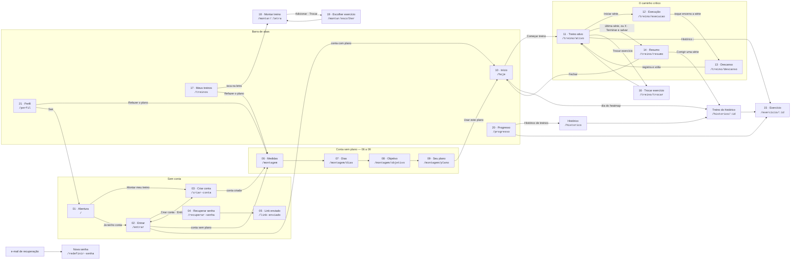

# Telas e fluxos — Série.

Este arquivo é o mapa do app final (CP6): quais telas existem, por qual rota se chega em cada uma,
o que cada uma exige para abrir e de onde vem cada número que ela mostra. O desenho de cada tela
está em [`telas/`](telas/) (exportado do Figma). As regras citadas estão em
[`regras.md`](regras.md) (treino, `CAR-*`) e [`regras-do-app.md`](regras-do-app.md) (app, `RN-*`).
Para quem vai **usar** o app, o passo a passo está no [`manual-de-uso.md`](manual-de-uso.md).

## O mapa de navegação

**Quem decide para onde você vai é o login, não a tela.** O
[`_layout.tsx`](../src/app/_layout.tsx) separa as rotas em três áreas com o `Stack.Protected` do
Expo Router: sem conta (01–05), conta sem plano (06–09) e conta com plano (o resto). Entrar, sair
ou aceitar o plano troca a área, e o app leva sozinho à primeira tela que vale. Uma rota da área
errada nem abre (RN-01).

## As telas

| # | Tela | Rota | Abre para | O número dominante sai de… |
|---|---|---|---|---|
| 01 | Abertura | `/` | sem conta | — (marca) |
| 02 | Entrar | `/entrar` | sem conta | — |
| 03 | Criar conta | `/criar-conta` | sem conta | — (nome, e-mail, senha de 8+) |
| 04 | Recuperar senha | `/recuperar-senha` | sem conta | — |
| 05 | Link enviado | `/link-enviado` | sem conta | — (não diz se o e-mail existe) |
| — | Nova senha | `/redefinir-senha` | o link do e-mail | — |
| 06 | Medidas | `/montagem` | conta | o peso, que define a carga de partida |
| 07 | Dias por semana | `/montagem/dias` | conta | os dias, que definem a divisão (A/B ou A/B/C) |
| 08 | Objetivo | `/montagem/objetivo` | conta | a faixa de repetições do objetivo |
| 09 | Seu plano | `/montagem/plano` | conta | o plano gerado das três respostas (`gerarPlano`) |
| 10 | Início | `/hoje` | conta com plano | a letra do dia, **a próxima do rodízio** (RN-20), e o heatmap do ano (RN-50 a RN-54) |
| 11 | Treino ativo | `/treino/ativo` | treino em andamento | a carga alvo, pela dupla progressão (`CAR-1`) sobre a **última** vez do exercício |
| 12 | Execução | `/treino/execucao` | treino em andamento | o cronômetro da série (`CAR-11`) |
| 13 | Descanso | `/treino/descanso` | treino em andamento | o descanso, com reps e carga já preenchidas com o alvo (`CAR-2`) |
| 14 | Resumo | `/treino/resumo` | treino terminado | **em quantos exercícios você evoluiu** contra a mesma letra da vez anterior (`CAR-7`), e o alvo da próxima vez |
| 15 | Exercício | `/exercicio/:id` | conta com plano | o 1RM recorde (`CAR-5`), com a prescrição de hoje e o histórico |
| 16 | Trocar exercício | `/treino/trocar` | treino em andamento | — as variações do mesmo padrão e grupo (`CAR-9`) |
| 17 | Meus treinos | `/treinos` | conta com plano | — os dias de treino e o rodízio das letras |
| 18 | Montar treino | `/montar/:letra` | conta com plano | — os exercícios da letra, com séries, faixa, carga e descanso (RN-11 a RN-15) |
| 19 | Escolher exercício | `/montar/escolher` | conta com plano | — o catálogo, para adicionar ou trocar (RN-12, RN-12a) |
| 20 | Progresso | `/progresso` | conta com plano | treinos por semana e o volume por grupo contra 10–20 séries (`CAR-4`) |
| 21 | Perfil | `/perfil` | conta com plano | — o estado da nuvem, exportar CSV, apagar o histórico, sair |
| — | Histórico | `/historico` | conta com plano | todos os treinos, por mês |
| — | Treino do histórico | `/historico/:id` | conta com plano | as séries do treino, corrigíveis (RN-40 a RN-43) |

As telas sem número não estão no Figma do CP4: surgiram no CP6, quando o app passou a ter conta
de verdade (a nova senha) e a deixar corrigir o que foi registrado (o histórico).

## De onde vêm os dados

O aparelho é a fonte da verdade; o Supabase é a cópia na nuvem. Tudo é gravado primeiro no
aparelho (AsyncStorage, por usuário) e sobe quando houver rede:

| Dado | Onde mora no aparelho | Na nuvem | Código |
|---|---|---|---|
| Catálogo de 45 exercícios, 7 padrões de movimento | no código | — | [`src/data/exercicios.ts`](../src/data/exercicios.ts) |
| A conta | sessão do Supabase Auth | `auth.users` | [`src/estado/auth.tsx`](../src/estado/auth.tsx) |
| Respostas da montagem + o plano | `serie:perfil:v1:<usuário>` | `perfis` (o plano em `jsonb`) | [`src/estado/perfil.tsx`](../src/estado/perfil.tsx) |
| Histórico de treinos | `serie:historico:v2:<usuário>` | `sessoes` + `series` | [`src/estado/historico.tsx`](../src/estado/historico.tsx) |
| Treino em andamento | `serie:sessao:v2:<usuário>` (retomável por 6 h, `CAR-8`) | — fica só no aparelho | [`src/estado/sessao.tsx`](../src/estado/sessao.tsx) |

O histórico guarda **só as séries**. Recorde, "a última vez", o que evoluiu, o heatmap e a próxima
letra são calculados delas pelas funções puras de [`src/domain/`](../src/domain/), testadas com
Jest. Guardar esses números à parte foi o que fez o mock do CP4 se contradizer. Os dados de
fábrica do CP5 ([`src/data/treinos.ts`](../src/data/treinos.ts) e
[`src/data/historico.ts`](../src/data/historico.ts)) continuam no repositório como massa dos
testes; o app não os usa mais.

## O fluxo principal, passo a passo

1. **Abertura → Montar meu treino → Criar conta** (nome, e-mail, senha). A conta nasce com um perfil
   vazio, criado por um gatilho no banco.
2. **06 a 09**: peso, dias por semana e objetivo. A **09** mostra o plano gerado; **Usar este
   plano** salva e abre o **Início**.
3. **Início**: a letra do dia e o que mudou desde a última vez (*"Supino reto sobe para 42,5 kg"*,
   porque na última sessão o topo da faixa foi fechado em todas as séries). Embaixo, o heatmap do
   ano.
4. **Começar treino** → **Treino ativo** → **Iniciar série** → **Execução**: a tela inteira é o
   botão; durante a série ninguém toca no celular.
5. O toque encerra a série → **Descanso**: os campos chegam preenchidos com o alvo. Confirmar é
   não mexer; corrigir é **−** e **+**. Ao fim do descanso a série é registrada e o app volta ao
   Treino ativo, na série seguinte.
6. Aparelho ocupado? **Trocar exercício** oferece as variações do mesmo padrão de movimento e do
   mesmo grupo muscular. Numa variação nunca feita, a carga é marcada como *estimada*.
7. Depois da última série, ou pelo **X → Terminar e salvar**, o **Resumo** fecha o ciclo: o que
   evoluiu, os recordes e o alvo da próxima vez. A sessão entra no histórico e sobe para a nuvem.
8. De volta ao **Início**, a letra já é a próxima e o dia de hoje acendeu no heatmap.

## Os fluxos de edição

- **Mudar o plano** (17 → 18 → 19): dias de treino, ordem das letras, nome, exercícios (adicionar,
  trocar, mover, tirar) e os números de cada um. Vale a partir do próximo treino; o treino em
  andamento segue a versão de quando começou (RN-17).
- **Corrigir o que foi registrado** (Progresso → Histórico → treino, ou Resumo → **Corrigir uma
  série**): reps e carga de uma série, tirar uma série, apagar o treino. A correção sobe para a
  nuvem e recorde, progresso e heatmap se recalculam (RN-40 a RN-43).
- **Refazer o plano do zero** (Treinos ou Perfil → 06): as mesmas três perguntas, já preenchidas.
  O histórico continua.
