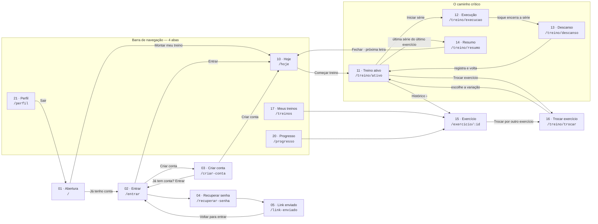

# Telas e fluxos — Série.

O CP5 pede a documentação das telas e dos fluxos do protótipo. Este arquivo é o mapa: quais telas
existem **em código**, por qual rota se chega em cada uma e de onde vem cada número que ela mostra.
O desenho de cada tela está em [`telas/`](telas/) (exportado do Figma) e as regras citadas
(`CAR-*`) estão em [`regras.md`](regras.md).

## O mapa de navegação

## As telas em código

| # | Tela | Rota | O número dominante sai de… |
|---|---|---|---|
| 01 | Abertura | `/` | — (marca) |
| 02 | Entrar | `/entrar` | — |
| 03 | Criar conta | `/criar-conta` | — |
| 04 | Recuperar senha | `/recuperar-senha` | — |
| 05 | Link enviado | `/link-enviado` | — |
| 10 | Hoje | `/hoje` | a letra do treino: **a próxima depois da última sessão fechada** (`proximoTreino`) |
| 11 | Treino ativo | `/treino/ativo` | a carga alvo, pela dupla progressão (`CAR-1`) sobre a última vez do exercício |
| 12 | Execução | `/treino/execucao` | o cronômetro da série (`CAR-11`) |
| 13 | Descanso | `/treino/descanso` | o descanso, com reps e carga já preenchidas com o alvo (`CAR-2`) |
| 14 | Resumo | `/treino/resumo` | a tonelagem da sessão, comparada com a mesma letra da vez anterior (`CAR-7`) |
| 15 | Exercício | `/exercicio/:id` | o 1RM recorde (`CAR-5`), com a prescrição de hoje e o histórico |
| 16 | Trocar exercício | `/treino/trocar` | — a lista das variações do mesmo padrão (`CAR-9`) |
| 17 | Meus treinos | `/treinos` | — as letras do plano |
| 20 | Progresso | `/progresso` | treinos por semana, e o volume por grupo contra a faixa de 10–20 séries (`CAR-4`) |
| 21 | Perfil | `/perfil` | — ajustes, exportar CSV, apagar dados, sair |

**Fora do CP5, de propósito:** 06–09 (montagem do plano pelo onboarding), 18 (Montar treino) e
19 (Escolher exercício). O plano A/B/C vem pronto dos dados mockados — ver
[`decisoes-tecnicas.md`](decisoes-tecnicas.md) §11 (item 2).

## De onde vêm os dados

Tudo é local. O enunciado do CP5 pede dados mockados, e o app é offline-first por requisito
(academia é subsolo):

| Dado | Arquivo | Como |
|---|---|---|
| Catálogo de 45 exercícios, 7 padrões de movimento | [`src/data/exercicios.ts`](../src/data/exercicios.ts) | mock fixo |
| O plano A/B/C | [`src/data/treinos.ts`](../src/data/treinos.ts) | mock fixo |
| Histórico de treinos | [`src/data/historico.ts`](../src/data/historico.ts) → [`src/estado/historico.tsx`](../src/estado/historico.tsx) | semente na primeira abertura; depois, **AsyncStorage** |
| Sessão em andamento | [`src/estado/sessao.tsx`](../src/estado/sessao.tsx) | memória + AsyncStorage (retomável por 6 h, `CAR-8`) |

O histórico guarda **só as séries**. Recorde, tonelagem anterior, "a última vez" e a próxima letra
são derivados delas pelas funções puras de [`src/domain/historico.ts`](../src/domain/historico.ts),
testadas com Jest. Guardar esses números à parte foi o que fez o mock antigo se contradizer.

## O fluxo principal, passo a passo

1. **Hoje** mostra a próxima letra e o que mudou desde a última vez (ex.: *"Supino reto sobe para
   42,5 kg"*, porque na última sessão o topo da faixa foi fechado nas quatro séries).
2. **Começar treino** abre a sessão e leva ao **Treino ativo** do primeiro exercício.
3. **Iniciar série** → **Execução**: a tela inteira é o botão; durante a série ninguém toca no celular.
4. O toque encerra a série → **Descanso**: os campos chegam preenchidos com o alvo. Confirmar é um
   toque; corrigir é possível. O registro volta ao Treino ativo, na série seguinte.
5. Aparelho ocupado? **Trocar exercício** oferece as variações do mesmo padrão de movimento e do
   mesmo grupo muscular (composto só troca por composto), fora o que já está em outro item do treino
   do dia. Numa variação que nunca foi feita, a carga é marcada como *estimada*.
6. Depois da última série do último exercício, o **Resumo** fecha o ciclo, e a sessão entra no
   histórico.
7. De volta ao **Hoje**, a letra já é a próxima. O app aprendeu.
