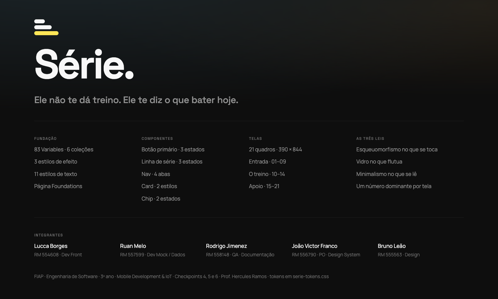

# As 21 telas

Espelho em PNG do arquivo do Figma — **exportado tela a tela pelo MCP do Figma Desktop**
(`get_screenshot`, um nó por tela), na resolução do quadro: 390 × 844.

**Figma:** https://www.figma.com/design/j9TqnMGzyjEpdjw18cLPBp — página `Telas`, section `Telas`.

> ⚠️ Estes arquivos **não se atualizam sozinhos**. Quem mexer no Figma reexporta, senão o README
> passa a mostrar um desenho que não existe mais. O arquivo do Figma é a fonte de verdade; isto aqui
> é cópia para quem não tem acesso a ele — e para a documentação do CP4, que pede a identidade
> visual junto da entrega.

## Entrada e conta

| Tela | Arquivo | ID no Figma |
|---|---|---|
| 01 · Abertura | [`01-abertura.png`](01-abertura.png) | `24:62` |
| 02 · Entrar | [`02-entrar.png`](02-entrar.png) | `72:419` |
| 03 · Criar conta | [`03-criar-conta.png`](03-criar-conta.png) | `72:460` |
| 04 · Recuperar senha | [`04-recuperar-senha.png`](04-recuperar-senha.png) | `73:468` |
| 05 · Link enviado | [`05-link-enviado.png`](05-link-enviado.png) | `73:501` |
| 06 · Montagem 1 de 3 | [`06-montagem-1-de-3.png`](06-montagem-1-de-3.png) | `77:502` |
| 07 · Montagem 2 de 3 | [`07-montagem-2-de-3.png`](07-montagem-2-de-3.png) | `24:90` |
| 08 · Montagem 3 de 3 | [`08-montagem-3-de-3.png`](08-montagem-3-de-3.png) | `77:549` |
| 09 · Seu plano | [`09-seu-plano.png`](09-seu-plano.png) | `24:128` |

## O treino — o caminho crítico

As cinco que já estão em código. Os prints do app rodando estão em
[`../evidencias/`](../evidencias/) — comparar as duas fileiras é o teste de fidelidade do CP6.

| Tela | Arquivo | ID no Figma |
|---|---|---|
| 10 · Hoje | [`10-hoje.png`](10-hoje.png) | `20:3` |
| 11 · Treino ativo | [`11-treino-ativo.png`](11-treino-ativo.png) | `22:23` |
| 12 · Execução | [`12-execucao.png`](12-execucao.png) | `33:302` |
| 13 · Descanso | [`13-descanso.png`](13-descanso.png) | `23:56` |
| 14 · Resumo da sessão | [`14-resumo-da-sessao.png`](14-resumo-da-sessao.png) | `23:86` |

## Apoio

| Tela | Arquivo | ID no Figma |
|---|---|---|
| 15 · Exercício | [`15-exercicio.png`](15-exercicio.png) | `25:66` |
| 16 · Trocar exercício | [`16-trocar-exercicio.png`](16-trocar-exercicio.png) | `25:126` |
| 17 · Meus treinos | [`17-meus-treinos.png`](17-meus-treinos.png) | `26:70` |
| 18 · Montar treino | [`18-montar-treino.png`](18-montar-treino.png) | `38:324` |
| 19 · Escolher exercício | [`19-escolher-exercicio.png`](19-escolher-exercicio.png) | `42:367` |
| 20 · Progresso | [`20-progresso.png`](20-progresso.png) | `26:133` |
| 21 · Perfil | [`21-perfil.png`](21-perfil.png) | `26:221` |

## A capa do arquivo (com os integrantes)

[`capa-figma.html`](capa-figma.html) é a capa da página `Cover` reescrita em HTML, para ser
**importada de volta pelo html.to.design** — é assim que os integrantes entram no arquivo sem
ninguém desenhar caixa de texto à mão. As medidas, cores e tipos foram lidos do próprio nó do Figma
(`get_design_context` no nó `27:2`), então o resultado casa com o que já está lá.

O que muda em relação à capa que está no arquivo hoje:

| Onde | Estava | Fica |
|---|---|---|
| Fundação | 71 Variables | **83 Variables** |
| Telas | 12 quadros | **21 quadros** |
| Telas | Entrada 01–03 · O treino 04–07 · Apoio 08–12 | **01–09 · 10–14 · 15–21** |
| — | *(não existia)* | **bloco Integrantes**, com nome, RM e papel dos 5 |
| Rodapé | Projeto de faculdade · v0.1 | disciplina, ano, checkpoints e professor |

> ⏸️ **Ainda não foi aplicado no Figma.** O MCP `html-to-design` responde `401 unauthorized` —
> precisa de login. Num terminal interativo: `claude mcp login html-to-design`. Depois disso a
> importação é uma chamada só.

## As tiras do README

[`grupo-1-entrada.png`](grupo-1-entrada.png) · [`grupo-2-treino.png`](grupo-2-treino.png) ·
[`grupo-3-apoio.png`](grupo-3-apoio.png) — as três fileiras montadas lado a lado, que é o que o
README exibe. Geradas a partir dos PNGs individuais desta pasta.
